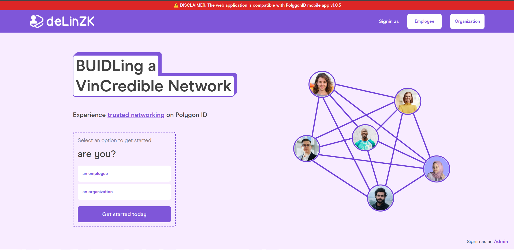
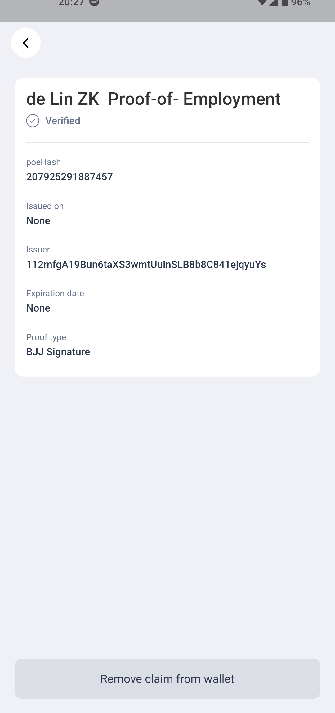
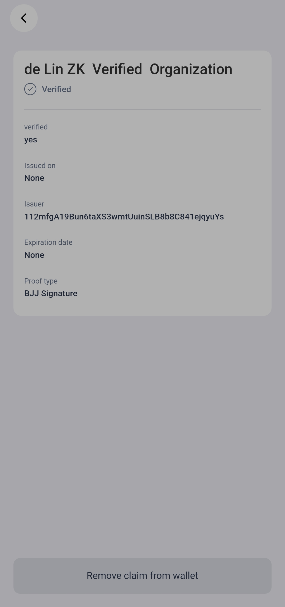
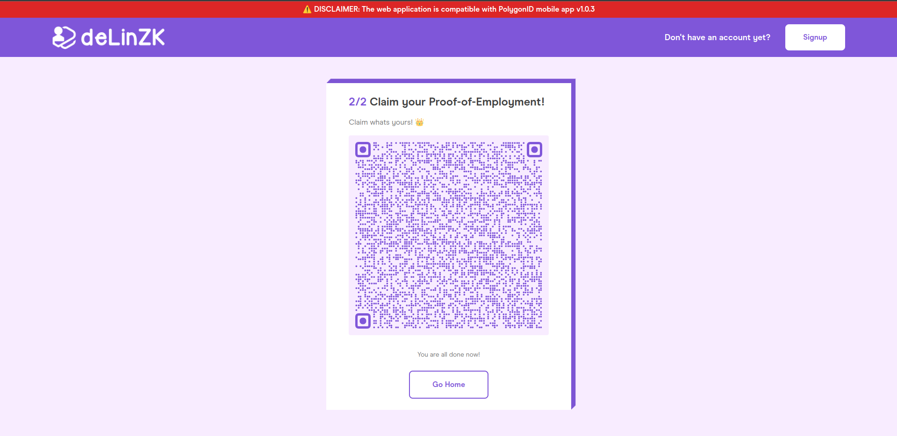
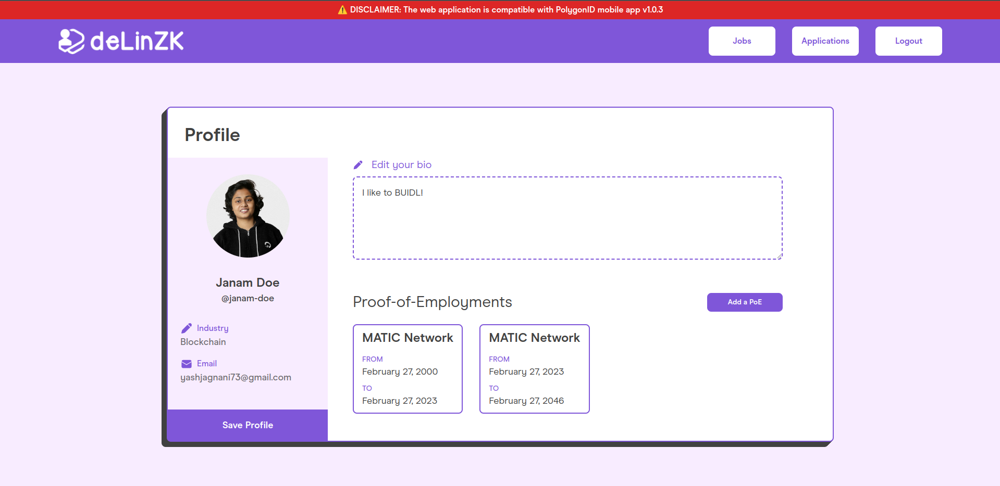
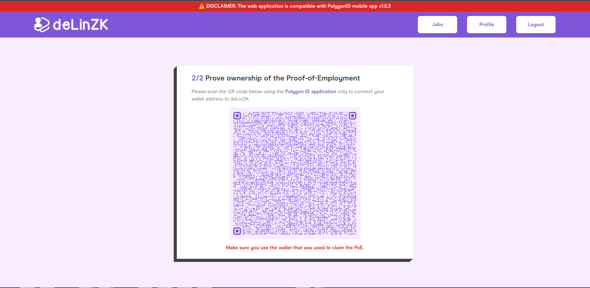
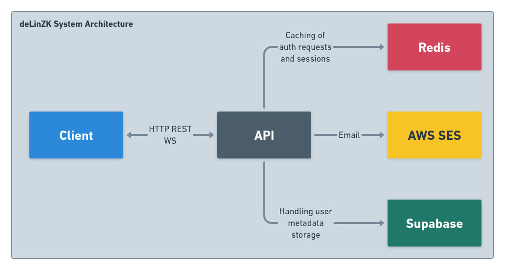
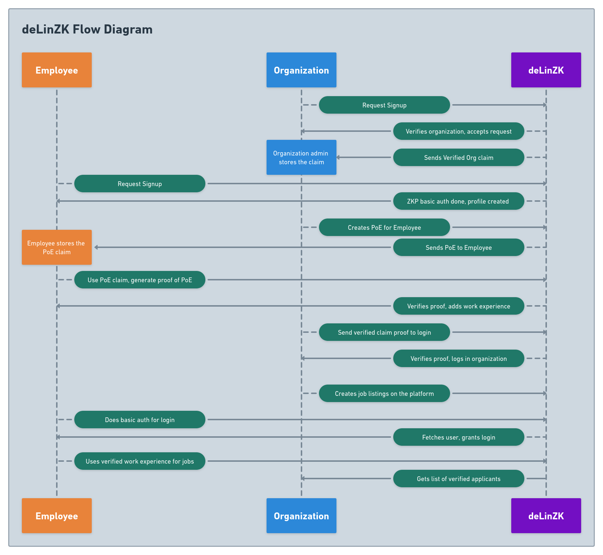

<div align="center">
  
</div>
<br>
<div align="center">
  
</div>

<br>
<p align="center">
Team <b>DreamTeam</b> present <b>deLinZK</b>.
<br>
<b>BUIDL</b>ing a <b>V</b>in<b>Cred</b>ible Network

</p>
<blockquote align="center"> 
  Built with ❤️, delivered on ☕, verified by <a href="https://polygonid.com" target="_blank"><b>Polygon 🆔</b></a> <span>☕</span> at <a href="https://ethforall.devfolio.co/">ETHForAll Online VIII</a>.
</blockquote>

<div align="center"><br /><br /><h1><b>Video Demo 📼: <a href="https://youtu.be/VlDw8FXiws4" target="_blank">HERE</a></b></h1></div><br />

# 💡 **Problem Statement**

The problem with the current networking platforms are that there is no surety in the work experience which users claim to have. The users can also fake their way through, having forged certificates or even having certificates from pseudo-companies, which do not even exist. This is why recruiters resort to using different B2B credential verifiers, which not only charge an absurd amount of money, but also extract a lot of PII (Personal Identifiable Information) from the applicants who apply to these organizations.

So, there was a need to find a platform which could have credential-verification in-built, and take as less PII from the applicants.

### 🥁🥁 **Drumroll, please...enter deLinZK 🔥🔥**

deLinZK is a Zero-Knowledge solution to the above problem, providing a platform both for organizations and employees or users of the platform, to accurately issue Verifiable Credentials which serve as Proof-of-Employments, and for employees it also serves as a proof of work experience after they finish tenure in their current company. deLinZK also provides a comprehensive job board which allows organizations to post jobs, and the employees to apply to them. The organizations do not need to spend additional time verifying the work experience of the applicants, since all of them are already verified by deLinZK through a ZKP way.

# 🧠 **Knowledge Primer**

- An _Employee_ is an individual who is working, or has worked for an organization.
- An _Organization_ is an entity that is either looking for an _Employee_ or has some employed.
- An _Admin_ is an envoy of **deLinZK**. They have the duty to verify the PII of the organizations, and on verification of their business details, grant them access to the organizer portal.
- The only authentication the web application uses is _Zero Knowledge Proofs_, which are a type of cryptographic proofs generated based on the claims the application users hold. No personal data is shared while proving any claim, and e-mails are used merely for communication.
- There are two types of claims issued by deLinZK:
  - _deLinZK Verified Organization_: This claim holder can verify that they are an admin of an organization verified by deLinZK. This claim can only be issued by the deLinZK admin team, on verification of business documents.
  - _deLinZK Proof-of-Employment_: This claim is issued by an organization to it's employees, either retiring or existing employees. The claim data contains a 48-bit **SHAKE128** hash of the tenure of the Employee and the organization ID which issued the claim.

# 💪 **Challenges Faced (and WAGMI!)**

- One of the main challenges we faced was the novelty of the implementation, and the experimental phase of the technologies it uses:
  - While developing, PolygonID and Iden3 were under active development, hence often introduced major breaking changes. Although we could fix some, we ended up version locking certain dependencies to make the web application work within the deadline of the hackathon. The team will continue to adapt the codebase change from the dependent technologies, so that deLinZK continues to provide its users the safety and security of disclosing their employments.
  - Some of the specification changes do break the initial users of the applications. For example, the current users are being issued Polygon ID proprietary schemas, but after the update they will be provided with W3C Verifiable Credentials, which won't be compatible with the current claims. The Iden3 circuits have also changed their specifications, which also changes the query structure which the newer versions of the PolygonID mobile app have, but the older ones cannot.
- Handling real-time data and callbacks was another challenge we faced while making the application. Due to the nature of verification, we had to incorporate complicated Websocket and REST API logic in the same server. In order to maintain the request state between the different callback requests, Redis caching was implemented.
- Encryption was also at the top-most priority while building the application. Since, no PII is shared in the application, but we needed to authenticate different users of the application, we resorted to scrap traditional JWTs for much more advanced JWEs having JWSs inside their payload.
- One of the most interesting challenges we faced was while building the Proof-of-Employment schema:
  - We wanted to pass the data in the format to the claim schema:
  ```bash
  Format suggested: <STARTDATE><ENDDATE><ORGID>
  Example format: YYYYMMDDYYYYMMYYYYORGID
  Example value: 2000123120230526125
  - Start Date: 31-12-2000
  - End Date: 26-05-2023
  - Organization ID: 125
  ```
  - The issue was the number generated with this method, was exceeding the limit imposed by the PolygonID platform. The maximum it could parse was a 15-digit integer.
  - The initial search started with finding hash algorithms which returned decimals as outputs, which we quickly realized was not possible directly. So the 'bit calculation' game started. Idea was to get some Hexadecimal string, and then converting it to decimal, but we needed something less than 50-bits.
  - Hence, we came across **SHAKE-128**, which could give us a 48-bit Hexadecimal string.
  - So we hashed the PoE value, converted the Hash into Hexadecimal, and then change the radix of the bits to 10, hence getting a decimal number less than 15-digits.
  - **Ingenious, isn't it?** 🤯

# 📺 **Previews**

<div align="center">
<div align="center">
<h2><b>Home Screen 🏠</b></h2>
  
</div>
<h2><b>Claim Schemas 📜</b></h2>

|  |  |
| ----------------------------------------------- | ----------------------------------------------- |

<small><b>Left: Claim schema for Proof-of-Employment, Right: Claim schema for Verified Organization</b></small>

</div>
<div align="center">
<h2><b>Organization Creating Proof-of-Employment 🛠️</b></h2>
  
</div>
<div align="center">
<h2><b>Employee Claiming the Proof-of-Employment 👑</b></h2>
  
</div>
<div align="center">
  <h2><b>Employee Profile Page 🫂</b></h2>
  
</div>
<div align="center">
  <h2><b>Employee Adding new Proof-of-Employments</b></h2>
  
</div>
<div align="center">
<h2><b>Organization Creating Jobs ⚙️</b></h2>
  
</div>

# 💻 **Tech Stack**

- PolygonID
- Supabase
- ExpressJS
- iden3
- JWT (JWZ and JWE)
- ReactJS
- NextJS
- NodeJS
- TypeScript
- Redis

# 📦 **Inside the box**

deLinZK is a platform that specializes in providing advanced verification services to organizations and their employees. The platform uses Zero Knowledge Proofs using PolygonID and its Self-Sovereign Identity policies to allow:

- Organizations to verify their legitimacy.
- Employees to verify their tenure in an organization.

It has an extensive system architecture to support such actions, as well as a comprehensive user flow through the web application. The following diagrams explain the flow:

### 1. **System Architecture Diagram**



### 2. **Flow Diagram**



# 👀 **How do you get started contributing to deLinZK?**

- Clone the project, and open it in your editor of choice.
- Setup Redis, Supabase.
- Create schemas for Proof-of-Employment and Verified Organization on the Polygon ID platform.
- Create an AWS account.
- Create Alchemy RPC URL.
- Rename and fill all the relevant values in the [**`.env`**](./server/.env.example) file.
- Rename and fill the frontend [**`.env`**](./client/.env.example) file as well.
- To start the server and the client:

  ```bash
  # Install dependencies
  yarn

  # For production server
  yarn build:server
  yarn production:server

  # For development server
  yarn dev:server

  # For production client
  yarn build:client
  yarn production:client

  # For development client
  yarn dev:client
  ```

# ⏭️ **What's next for deLinZK?**

- One of the major aim of deLinZK is to make the website more mobile-friendly, using deeplinks and more responsive design.
- We need to also figure out a more secure way of storing metadata of the organizations and users.
- Code cleanup and documentation never leaves the chat.
- Shifting from communicating with e-mail to some Web3 native solution.
- Integrating token gating services with deLinZK, to allow organizations to maintain gated communities, maybe even DAOs of their employees.
- If you, the reader have any suggestions, feel free to create an [**Issue 🚀!**](https://github.com/jagnani73/ethforall-delinzk/issues/new)

# 📜 **License**

`deLinZK` is available under the MIT license. See the [`LICENSE`](./LICENSE) file for more info.

# 🤝 **Contributing**

Please read [`CONTRIBUTING.md`](./CONTRIBUTING.md) for details on our code of conduct, and the process for submitting pull requests to us.

# 💥 **Contributors**

<a href="https://github.com/jagnani73/ethforall-delinzk/graphs/contributors">

</a>
                                                                                  
# 🚨 **Forking this repo**

Many people have contacted us asking if they can use this code for their own websites. The answer to that question is usually "yes", with attribution. There are some cases, such as using this code for a business or something that is greater than a personal project, that we may be less comfortable saying yes to. If in doubt, please don't hesitate to ask us.

We value keeping this site open source, but as you all know, _**plagiarism is bad**_. We spent a non-negligible amount of effort developing, designing, and trying to perfect this iteration of our website, and we are proud of it! All we ask is to not claim this effort as your own.

Refer to this handy [Quora post](https://www.quora.com/Is-it-bad-to-copy-other-peoples-code) if you're not sure what to do. Thanks!
